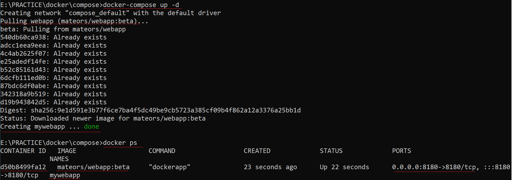

# Docker Compose
> Compose is a tool for defining and running multi-container Docker applications. With Compose, you use a YAML file to configure your application's services. Then, with a single command, you create and start all the services from your configuration.

## What is the difference between Docker and Docker compose?
> A Dockerfile is a simple text file that contains the commands a user could call to assemble an image whereas Docker Compose is a tool for defining and running multi-container Docker applications

## Using Compose is basically a three-step process:
1. Define your app’s environment with a Dockerfile so it can be reproduced anywhere.
2. Define the services that make up your app in docker-compose.yml so they can be run together in an isolated environment.
3. Run docker compose up and the Docker compose command starts and runs your entire app. You can alternatively run docker-compose up using the docker-compose binary.

### A docker-compose.yml looks like this:
```
version: "3" #comments
services:
    #Webapp
    webapp:
        image: mateors/webapp:beta
        container_name: mywebapp
        environment: 
            - MY_COLOR=skyblue
        ports:
         - 8180:8180
```

> Compose has commands for managing the whole lifecycle of your application:

* Start, stop, and rebuild services
* View the status of running services
* Stream the log output of running services
* Run a one-off command on a service

## Docker-compose Installation
> Docker Desktop for Windows & Mac includes Compose\
> Linux user please follow the instructios from the below url\
> https://docs.docker.com/compose/install

## Try the following commands (ubuntu 20.04) instead
> `sudo apt install curl`\
> `sudo curl -L "https://github.com/docker/compose/releases/download/1.29.2/docker-compose-$(uname -s)-$(uname -m)" -o /usr/local/bin/docker-compose`\
> `sudo chmod +x /usr/local/bin/docker-compose`\

## Docker compose version
> `docker-compose --version`\


## Executing My First docker-compose file docker-compose.yaml
> `docker-compose up -d`\


## Docker compose command starts and runs your entire app
> `docker-compose up -d`

> Now my webapp is up and running on port 8180, I can check on my browser\
> http://localhost:8180\


## References:
* [Compose command](https://docs.docker.com/compose/cli-command/)
* [Getting started](https://docs.docker.com/compose/gettingstarted/)