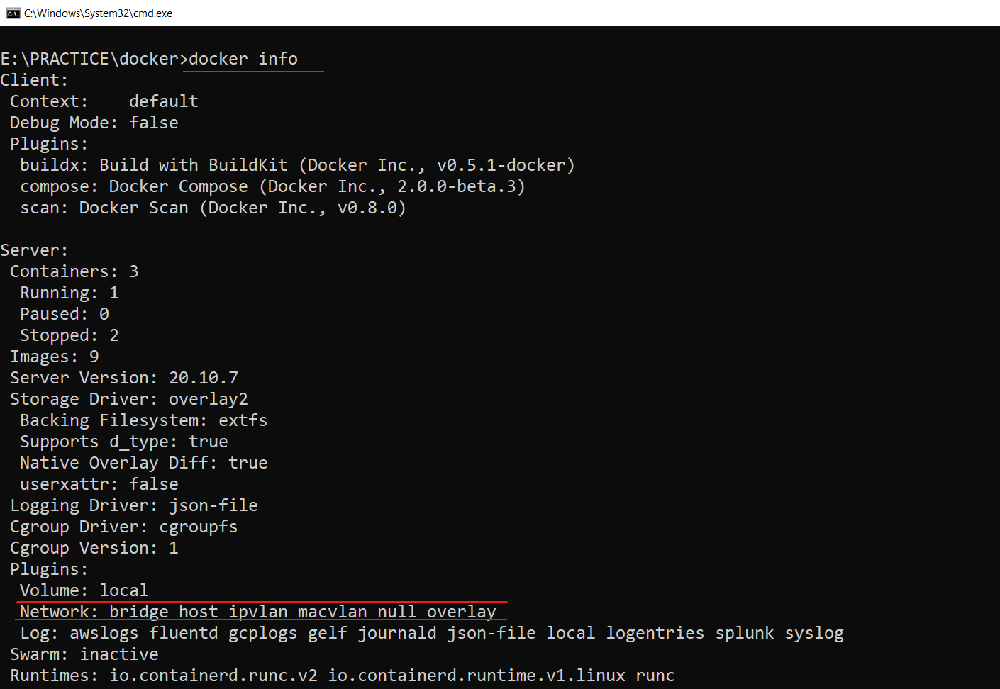

# Docker Networking
> Docker networking allows you to attach a container to as many networks as you like. You can also attach an already running container.

> `docker exec -it -u root <containerid> sh`\
> `ping webapp`\

> `docker info`\

> `docker network ls`\

> `docker run -it alpine:latest sh`\

## Host Network test
> `docker run -d --network host --name mynginx nginx:latest` (Not working in windows)\
> `docker stop mynginx`

## Create a custom bridge
> `docker network create cbridge`\
> `docker network ls`\
> `brctl show`\
> `docker run -dt  --network cbridge alpine:latest sh`\
> `docker ps`\
> `docker run -dt  --network cbridge alpine:latest sh`\
> `docker inspect cbridge`\
> `docker exec -it <containerid> sh`\
> `ping ip`

## Connect a container in a different network
> `docker network connect --help`\
> `docker network connect custom_bridge <containerid>`\